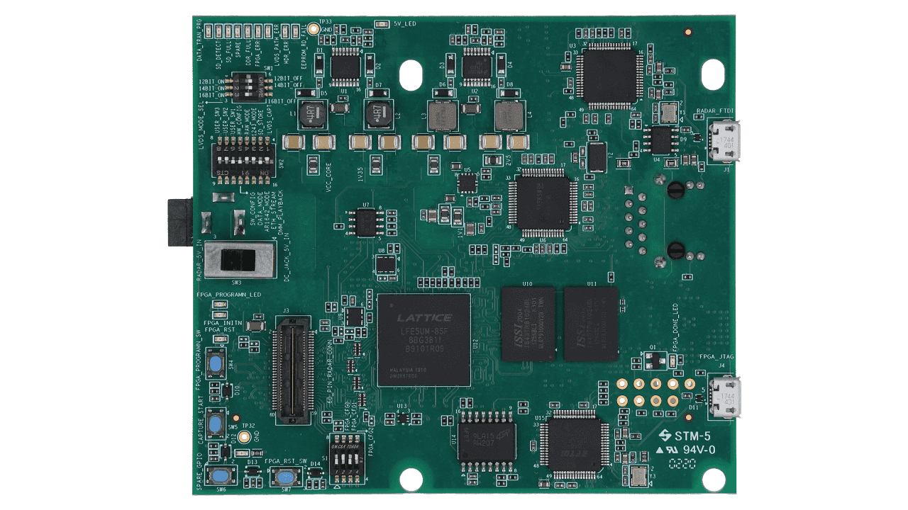
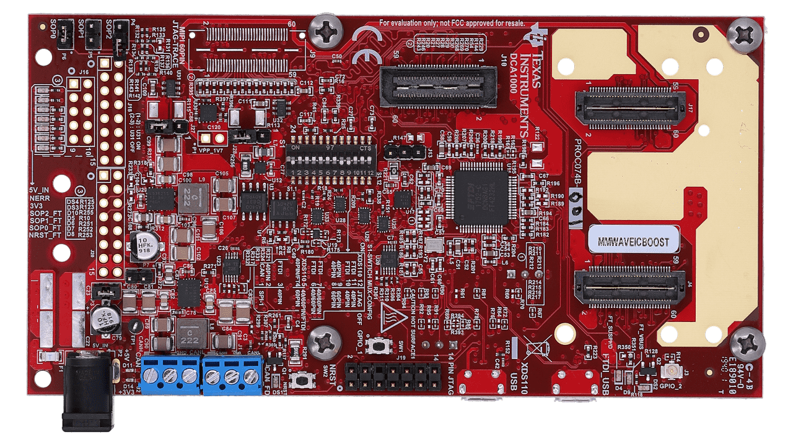

# xWR6843_DCA1000_GetData

## Function 

The main functions of the repository are as follows:

  - Use serial port to send cfg parameters to xWR6843 
  - Use DCA1000EVM_CLI_Control.exe to configure DCA1000 parameters
  - Start/stop DCA1000 to collect data

## How to Use it？
  - Download this repository to D:
  - Create "logs" and "RadarDate" directories
  - pip install requirement.txt
  - modify IWR6843_PKG/configs/profile_2d.cfg (If needed), but must ensure the parameter “lvdsStreamCfg -1 0 1 0”
  - modify serial port
  - IWR6843 is configured as DCA1000 capture card mode

## Hardware Configuration
- [DCA1000EVM](https://www.ti.com.cn/tool/cn/DCA1000EVM) Hardware platform and its technical documentation
    - [DCA1000EVM Data Capture Card](https://www.ti.com.cn/cn/lit/ug/spruij4a/spruij4a.pdf?ts=1649507004718&ref_url=https%253A%252F%252Fwww.ti.com.cn%252Ftool%252Fcn%252FDCA1000EVM)
    
    

      

        
      

    

  
- [MMWAVEICBOOST](https://www.ti.com.cn/tool/cn/MMWAVEICBOOST)
    - please configure it as DCA1000 mode: 
      > S1.1~S1.12 = [OFF, ON, ON, OFF, ON, OFF, OFF, OFF, OFF, ON, ON, ON]
      - Please set SOP to function mode: SOP[2:0] mode is "001"
  
    

      

            
      

    

- [IWR6843ISK](https://www.ti.com.cn/tool/cn/IWR6843ISK)
    - function mode: 
      > S1.1~S1.6 = [OFF, ON, ON, OFF, OFF, -]
    

- ref
    - [User’s Guide](https://www.ti.com.cn/cn/lit/ug/zhcu785d/zhcu785d.pdf?ts=1649506871580&ref_url=https%253A%252F%252Fwww.ti.com.cn%252Ftool%252Fcn%252FMMWAVEICBOOST)

## UART [Driver Link](https://www.silabs.com/developers/usb-to-uart-bridge-vcp-drivers)
  XDS110 enhanced/standard ports not found
  - Enhanced COM Port Driver
  - Standard COM Port Driver
    

## Reference

1. [Ti](https://www.ti.com/)
2. 
